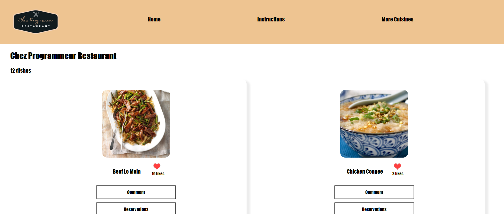
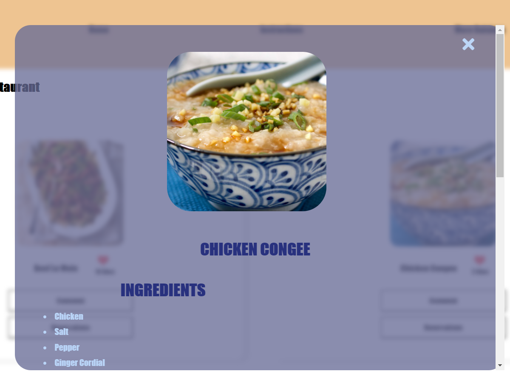
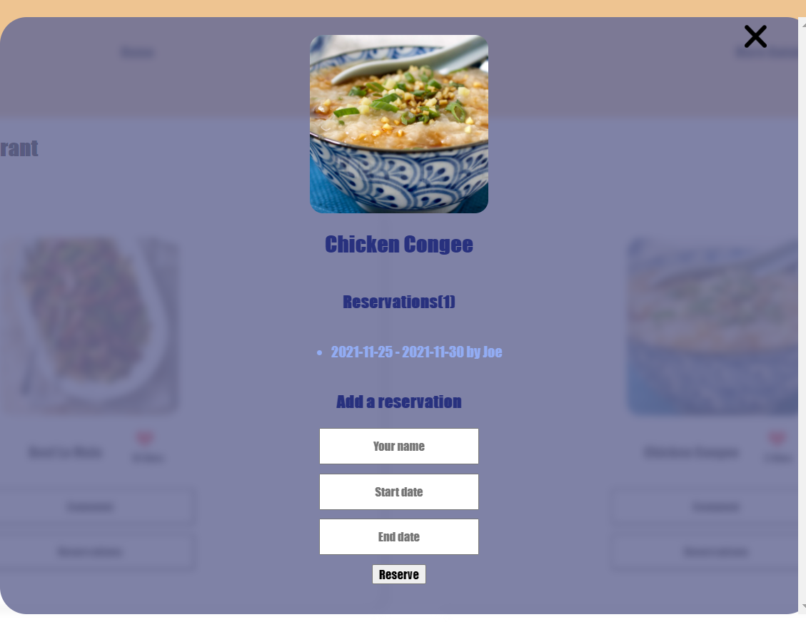

# Chez Programmeur Restaurant

This project Chez Programmeur Restaurant is a Restaurant website (SPA) that allows users to add comments, likes and reserve.

This project is part of the Microverse curriculum Module 2 Block 5 Capstone Week. The main objective is about building your own web application based on an external API. You will select an API that provides data about a topic that you like and then build the webapp around it.

### **Student A**
Karel van Oordt

### **Student B**
Syeda Juveria Afreen

### **Student C**
Hamid Murambiwa





## Built With

- Html/Css
- JavaScript

## Additional Tools

- Webhint
- Stylelint
- Eslint
- Lighthouse
- Webpack
- Jest
- Kanban Board
- Involvement API
- Host API

## Getting Started

To get a local copy of this project:

Clone this repository or download the Zip folder:
```
https://github.com/sja-thedude/Capstone-2-Group-Project.git
```

## Test
To track linter errors locally follow these steps:

Download all the dependencies run:
```
npm install
```
Track HTML linter errors run:
```
npx hint .
```
Track CSS linter errors run:
```
npx stylelint "**/*.{css,scss}"
```
Track JavaScript linter errors run:
```
npx eslint .
```
### Usage

The assets are in the `src` directory.

The output is in the `dist` directory.

### Deployment

To build the website:

```
npm run build
```

To serve the website directly:

```
npm run start
```

## Authors

👤 **Syeda Juveria Afreen**

- GitHub: [@github](https://github.com/sja-thedude)
- Twitter: [@twitter](https://twitter.com/sja_thedude)
- LinkedIn: [LinkedIn](https://www.linkedin.com/in/syeda-juveria-afreen-23165898/)

👤 **Karel van Oordt**
- GitHub: [@github](https://github.com/karelvanoordt)
- Twitter: [@twitter](https://twitter.com/karelvanoordtEN)
- LinkedIn: [LinkedIn](https://www.linkedin.com/in/karelvanoordt/)

👤 **Hamid Murambiwa**
- GitHub: [@github](https://github.com/hamid-murambiwa)
- Twitter: [@twitter](https://twitter.com/Hamid87789454)
- LinkedIn: [LinkedIn](https://www.linkedin.com/in/hamid-murambiwa-8a9a9520a/)

## 🤝 Contributing

Contributions, issues, and feature requests are welcome!
Feel free to check the [issues page](https://github.com/sja-thedude/Capstone-2-Group-Project/issues).

## Show your support

Give a ⭐️ if you like this project!

## Acknowledgments

- This project is part of week 5 (Capstone) of module 2 in the Microverse study program.
- Thanks to the Microverse team for the great curriculum.
- Thanks to Code Reviewers for the insightful feedback.
- A great thanks to My coding partners, morning session team, and standup team Partners for their contributions.

## 📝 License

This project is [MIT](./MIT.md) licensed.
